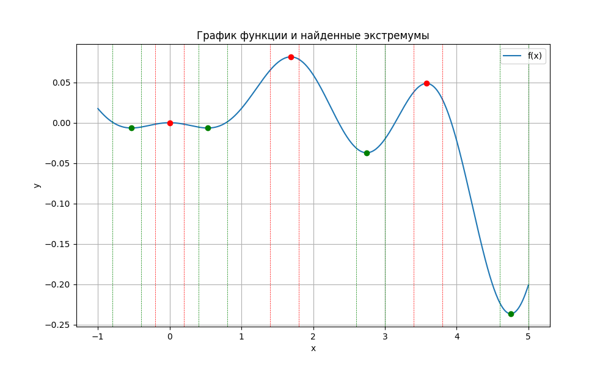

```python
def bisection_max(a, b, tol=1e-6, max_iter=100):
    intervals = 1
    initial_a, initial_b = a, b

    for _ in range(max_iter):
        c = (a + b) / 2
        df_c = df(c)

        if abs(df_c) < tol:  
            return c, intervals, (initial_a, initial_b)
        elif df_c > 0:  
            a = c
        else:  
            b = c

        intervals += 1
        if (b - a) < tol:
            break

    return (a + b) / 2, intervals, (initial_a, initial_b)

def golden_section_min(a, b, tol=1e-6, max_iter=100):
    golden_ratio = (3 - 5**0.5) / 2
    intervals = 1  
    initial_a, initial_b = a, b

    x1 = a + golden_ratio * (b - a)
    x2 = b - golden_ratio * (b - a)

    fx1 = f(x1)
    fx2 = f(x2)

    for _ in range(max_iter):
        if fx1 < fx2:
            b = x2
            x2 = x1
            fx2 = fx1  
            x1 = a + golden_ratio * (b - a)
            fx1 = f(x1)
        else:
            a = x1
            x1 = x2
            fx1 = fx2  
            x2 = b - golden_ratio * (b - a)
            fx2 = f(x2)

        intervals += 1
        if (b - a) < tol:
            break

    return (a + b) / 2, intervals, (initial_a, initial_b)
```

``` shell
Найденные экстремумы:
=====================================================================================
       x       |        y       |    Тип    |    Итерации    |       Диапазон
=====================================================================================
   -0.531004   |    -0.006549   |    min    |       19       | -0.800000 - -0.400000
   -0.000000   |    -0.000000   |    max    |        1       | -0.200000 - 0.200000
   0.531004    |    -0.006549   |    min    |       19       | 0.400000 - 0.800000
   1.687500    |    0.081529    |    max    |        5       | 1.400000 - 1.800000
   2.745522    |    -0.037195   |    min    |       19       | 2.600000 - 3.000000
   3.580469    |    0.048600    |    max    |        9       | 3.400000 - 3.800000
   4.754357    |    -0.236672   |    min    |       19       | 4.600000 - 5.000000
```


